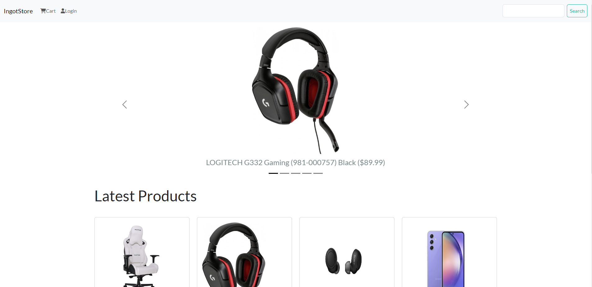
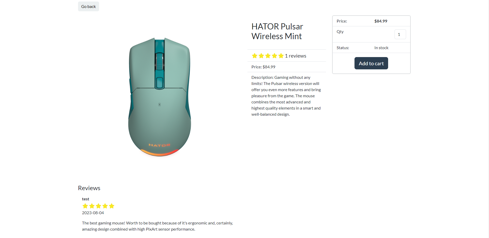
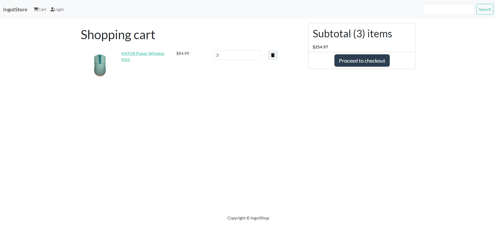
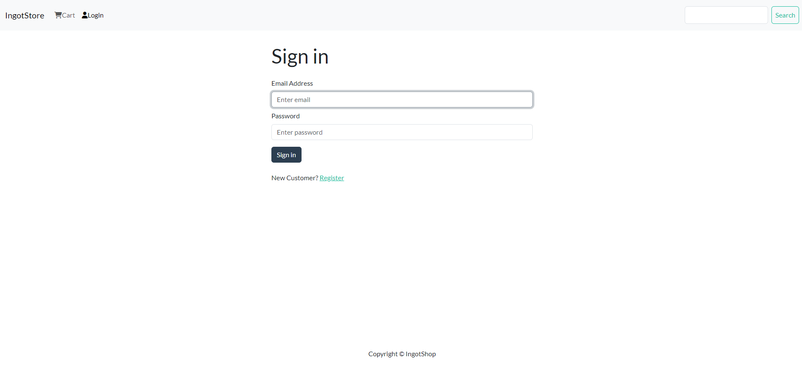
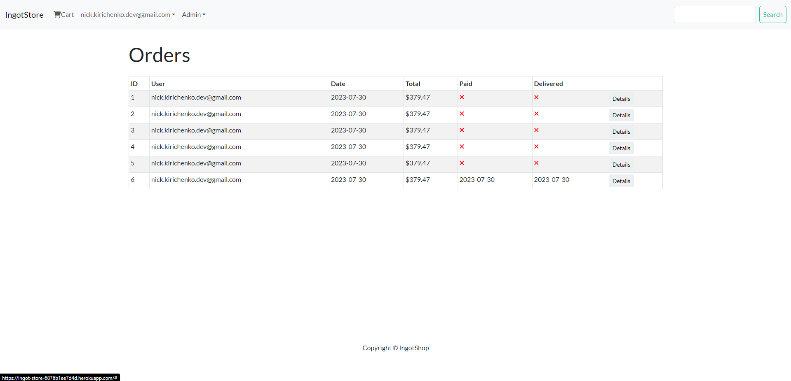
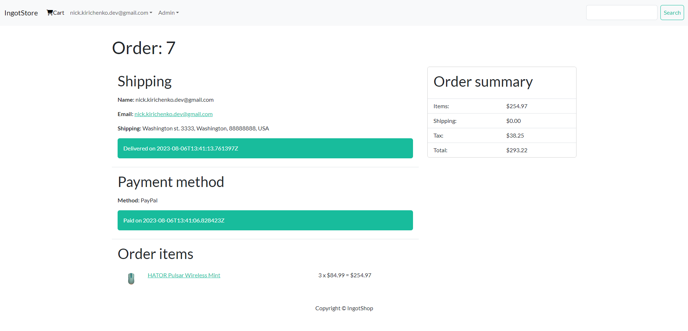

# Ingot-Store

<div align="center">

  
  <h1>Awesome Readme Template</h1>
  
  <p>
    E-commerse shop website built with Django and React
  </p>
   
<h4>
    <a href="https://ingot-store-6876b1ee7d4d.herokuapp.com/#/" target="_blank">View Demo</a>
  <span> · </span>
    <a href="https://github.com/Nar0kan/Ingot-Store/issues/" target="_blank">Report Bug</a>
</div>

<br />

<!-- Table of Contents -->
# :notebook_with_decorative_cover: Table of Contents

- [About the Project](#star2-about-the-project)
  * [Tech Stack](#toolbox-tech-stack)
  * [Features](#dart-features)
- [Getting Started](#gear-getting-started)
  * [Prerequisites](#prerequisites)
  * [Installation](#installation)
  * [Environment Variables](#environment-variables)
  * [Run Locally](#run-locally)
- [Acknowledgements](#gem-acknowledgements)
  

<!-- About the Project -->
## :star2: About the Project


Built while progressing through course. Using React with Redux for Frontend
and Django for API calls. Contain integration with PayPal. Site has different
rights and availabilities for unregistered/registered and admin users. Cart
items are saved in LocalStorage, so after page reload they won't disapear.
Connected to PostgreSQL Cloud Database on Railway (Demo). You can connect
it to your own local/cloud database. 

Some of the knowledge gains:
CRUD, Auth, REST, API, Models fields, Search and Pagination functionality, 
Gunicorn, Static & Media files, heroku deploy, railway postgres deploy,
React basics, LocalStorage, State Flow, React-Bootstrap, PayPal API.


Screenshots:

<div align="center">
  
  
  
  
  
  
</div>


<!-- TechStack -->
### :toolbox: Tech Stack

<details>
<summary>Backend</summary>
  <ul>
    <li>Django</li>
    <li>REST Framework</li>
  </ul>
</details>

<details>
<summary>Frontend</summary>
  <ul>
    <li>React</li>
    <li>Redux</li>
    <li>Bootstrap</li>
    <li>Pure CSS</li>
  </ul>
</details>

<details>
<summary>Database</summary>
  <ul>
    <li>PostgreSQL</li>
  </ul>
</details>

<!-- Features -->
### :dart: Features

* Shopping cart (saved in local storage)
* Product reviews
* Search, pagination
* User profiles (orders, settings)
* Admin page (products, orders)
* Checkout process (shipping, payment method, etc)
* PayPal / credit card integration

<!-- Getting Started -->
## 	:gear: Getting Started

<!-- Prerequisites -->
### Prerequisites

Node.js (npm) and python 3.11.0+


<!-- Installation -->
### Installation


* 1 - Clone the project
```bash
  git clone https://github.com/Nar0kan/Ingot-Store
```

* 2 - Install React  modules
```bash
  cd Ingot-Store/frontend
  npm install
  npm run build
  cd ..
```

* 3 - Create venv and activate it
```bash
  python -m venv venv
  venv\Scripts\activate
```

* 4 - Install Python modules
```bash
  pip install -r requirements.txt
```


<!-- Env Variables -->
### Environment Variables

To run this project, you will need to add the specified in .template.env environment variables to your .env file


<!-- Run Locally -->
### Run Locally

To run localy use:
```bash
  python manage.py runserver
```

If you get an error, consider to:
1) create .env file and fill it up with neccessary data (use .template.env);
2) change READ_FROM_DOT_ENV in your local variables, or in settings.py (change default to True, instead of False);
3) Install both React and Python and connect your own database.


<!-- Acknowledgments -->
## :gem: Acknowledgements

This project was built using this guide:
 - Course: https://www.udemy.com/course/django-with-react-an-ecommerce-website/?couponCode=387F19CD4087385E87C1
